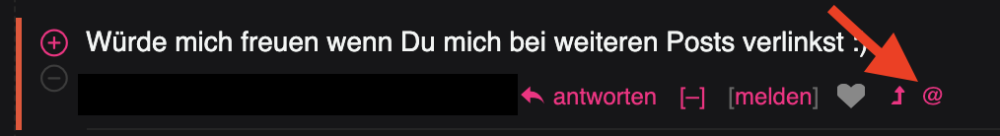
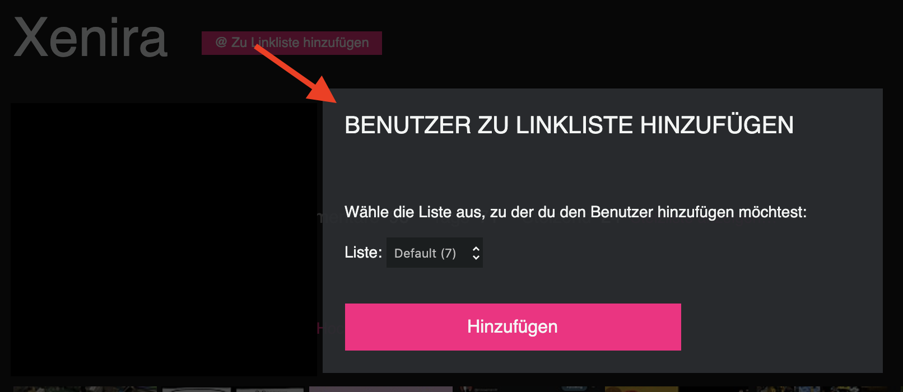
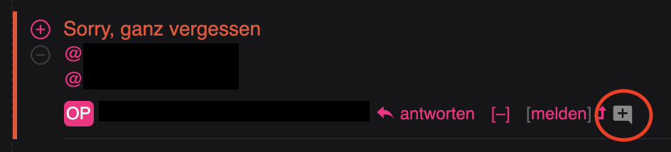
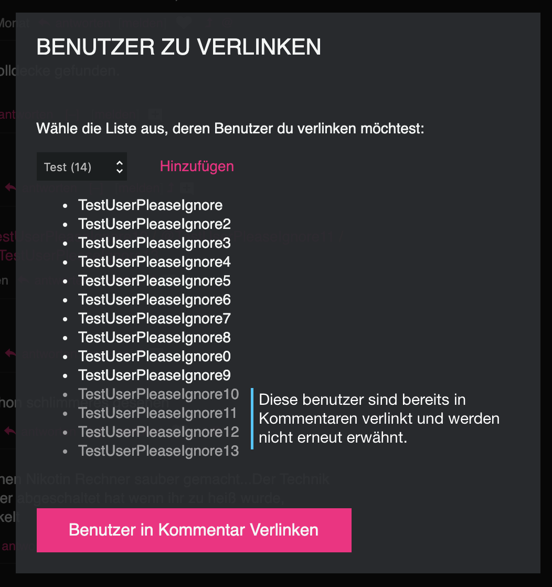
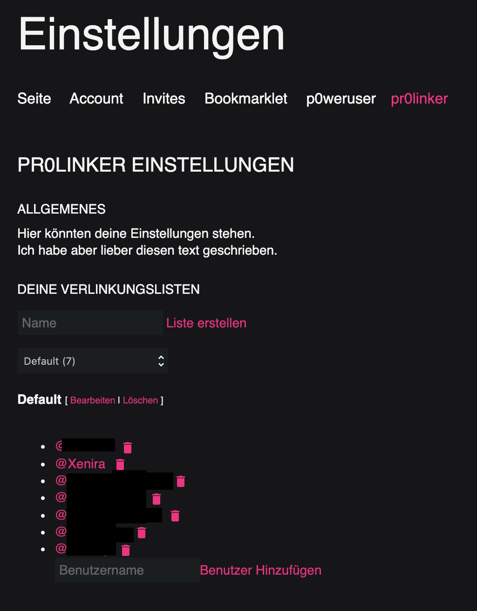

pr0linker
=========
v0.1
:toc: macro

Verlinke Benutzer automatisch unter deinen Posts auf dem pr0gramm.

WARNING: Dieses Userscript ist noch in der Testphase. Fehler können auftreten.

toc::[]

## Informationen

Ab und zu kommt es vor, dass man darum gebeten wird andere Benutzer zu verlinken. Mit diesem Userscript wird ein Button neben kommentaren und auf den Benutzerseiten einblendet

Damit dir dann sowas nicht passiert hast du neben deinen eigenen OP kommentaren einen button. Dieser öffnet einen dialog, welcher es dir erlaubt die zu verlinkenden Benutzer auszuwählen. Diese werden in Gruppen von bis zu 10 benutzern in einem Kommentar verlinkt.

### Einstellungen
Listen können ebenfalls über die Einstellungen verwaltet werden.

## Installation
INFO:: Um dieses Skript zu benutzen benötigst du Tampermonkey. Dieses Userscript wurde nur mit Chrome/Chromium getestet.

### Schnellinstallation
Wenn alles richtig aufgesetzt ist sollte ein klick auf diesen Link zur installation genügen: [Nicht verfügbar in der Testphase]

### Von den Releases
Unter https://github.com/Xenira/pr0linker/releases können 'Offizielle' releases gefunden werden. Lade die userskript datei herrunter und kopiere ihren Inhalt in ein Tampermonkey skript.

### Andere Versionen
Alle anderen Versionen können von https://github.com/Xenira/pr0linker/actions runtergeladen werden.
Stell bei der Installation sicher, dass du die Update-Url entfernst, da sich das Skript sonst selbstständig auf die neuste stabile version updated.

## Entwicklung
INFO:: Du brauchst nodejs und yarn.

Clone das Repository und führe die folgenden Befehle aus:
[source,bash]
----
yarn install
yarn start
----

Lege in Tempermonkey folgendes skript an:
[source,javascript]
----
// [linker]  // ==UserScript==
// @name         pr0linker-dev 
// @namespace    http://tampermonkey.net/
// @version      1.0.0
// @description  Localer Entwicklungsproxy
// @author       webpack-build
// @match        https://pr0gramm.com/*
// @grant        none
// @require      {{repo-path}}/dist/pr0linker.user.js
// ==/UserScript==
----

Ersetze `{{repo-path}}` mit dem Pfad des geklonten Repos.
Hier sind die erforderlichen Schritte: https://stackoverflow.com/a/55568568

Auf macos musst du `file:` vor den Pfad schreiben.

Mit diesem Setup werden Änderungen automatisch übernommen. Du musst jedoch die Seite neuladen um diese zu sehen.